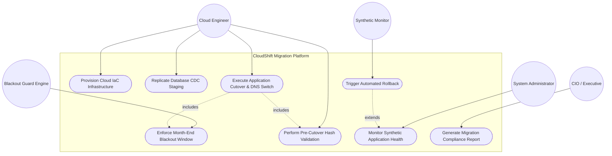
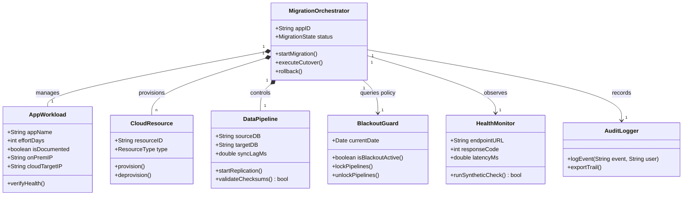
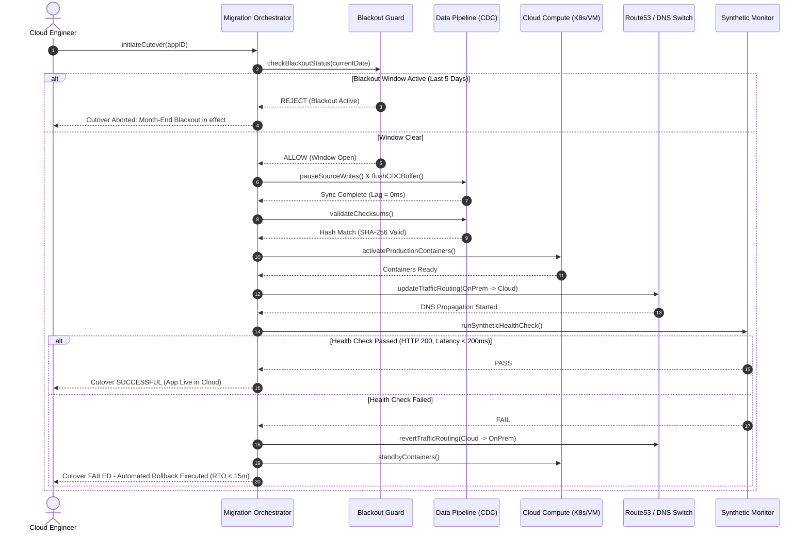
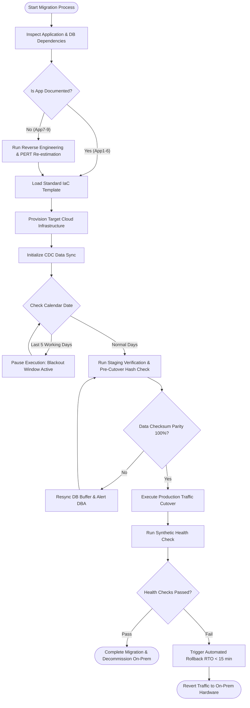
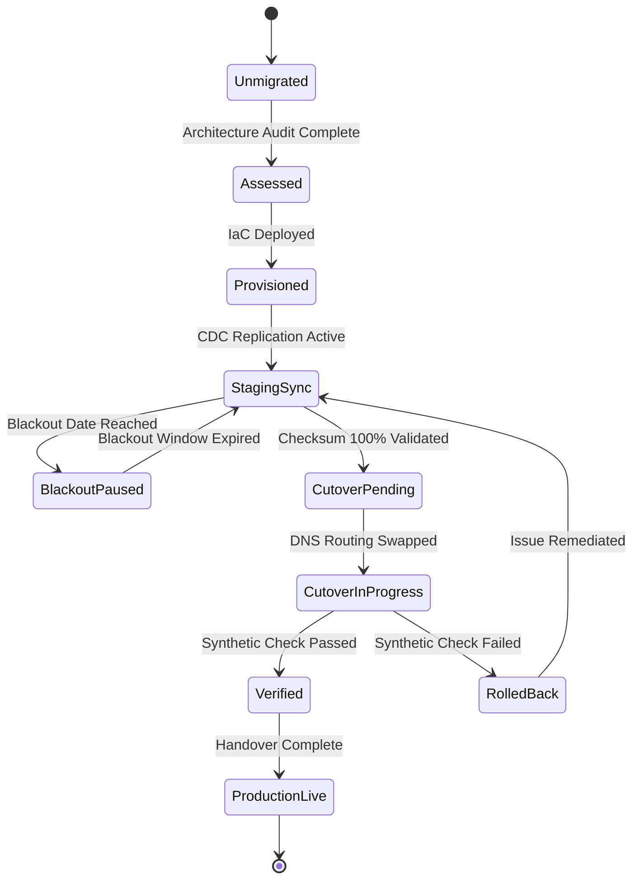

# CloudShift Migration Project
## Deliverable 2: UML Package & Architectural Design
**Document ID:** CS-UML-2026-V1.0  
**Project:** CloudShift - On-Premise to Cloud Migration  

---

### 1. Architectural Overview & Design Principles

To ensure zero downtime during business operations and high availability post-migration, the system architecture adheres to two fundamental software engineering principles:
1. **High Cohesion:** Each service or module encapsulates a single, tightly focused responsibility (e.g., Blackout Guard solely manages time-window policies; Database Replication Engine solely handles change data capture).
2. **Loose Coupling:** Application workloads and shared cloud infrastructure are decoupled via standardized APIs, Infrastructure-as-Code abstractions, and asynchronous event messaging. This ensures that changes to an application's internal code or DB schema do not impact shared infrastructure controllers.

---

### 2. UML Diagrams

#### 2.1 Use Case Diagram
The Use Case diagram illustrates primary actors (Cloud Engineer, System Administrator, CIO, Business User, Automated Blackout Guard) and their interactions with the migration system.

---

#### 2.2 Class Diagram
The Class diagram specifies the static structural relationships between core classes in the migration engine framework.

---

#### 2.3 Sequence Diagram: "Cut Over One Application to the Cloud"
This diagram models the end-to-end cutover procedure for a single application (e.g., App1), including pre-checks, blackout validation, database locking, DNS updates, synthetic validation, and rollback capability.

---

#### 2.4 Activity Diagram: Application Migration Lifecycle Workflow
This diagram details the decision steps, concurrency, and validation checkpoints during migration.

---

#### 2.5 State Diagram: Application Migration State Machine
Tracks the state transitions of an application workload through the migration lifecycle.

---

### 3. Cohesion and Coupling Justification

#### 3.1 Loosely Coupled Architecture
- **Infrastructure Abstraction:** Applications do not contain cloud-provider-specific SDK calls. They communicate via generic environment variables injected by Terraform IaC and Kubernetes ConfigMaps.
- **Data Layer Separation:** Change Data Capture (CDC) operates directly at the database transaction log level, ensuring zero invasive changes to application source code.
- **Asynchronous Health Checks:** Synthetic health monitoring operates externally over HTTP/HTTPS endpoints without blocking main application execution threads.

#### 3.2 High Module Cohesion
- **`BlackoutGuard` Module:** Exclusively handles date/time evaluation against the 5-day month-end calendar rules. It does not perform network operations or DB calls.
- **`DataPipeline` Module:** Focuses solely on database schema migration, CDC log streaming, and SHA-256 hash comparison.
- **`MigrationOrchestrator` Module:** Serves as a state machine controller, orchestrating workflow steps without embedding business logic from individual logistics apps.

---
