# CloudShift Migration Project
## Deliverable 3: Project Plan, WBS & Critical Path Schedule
**Document ID:** CS-PLAN-2026-V1.0  
**Project:** CloudShift - On-Premise to Cloud Migration  
**Resource Constraint:** 3 Engineers (Eng 1: DB Specialist, Eng 2: Cloud Infra, Eng 3: QA/App Lead)  

---

### 1. Work Breakdown Structure (WBS)

```
1.0 CloudShift Application Migration Project
 ├── 1.1 Phase 1: Planning, Discovery & Environment Setup
 │    ├── 1.1.1 Elicit requirements & stakeholder sign-off
 │    ├── 1.1.2 Audit legacy infrastructure & undocumented apps (App7-9)
 │    └── 1.1.3 Setup cloud landing zone & IAM RBAC foundation
 ├── 1.2 Phase 2: IaC Framework & Data Pipeline Construction
 │    ├── 1.2.1 Develop reusable Terraform / IaC modules
 │    ├── 1.2.2 Configure Change Data Capture (CDC) engine
 │    └── 1.2.3 Implement Blackout Guard automated lock service
 ├── 1.3 Phase 3: Wave-Based Application Migration Execution
 │    ├── 1.3.1 Wave 1 Migration (Low Complexity Apps: App1, App2, App3)
 │    ├── 1.3.2 Wave 2 Migration (Medium Complexity Apps: App4, App5, App6)
 │    └── 1.3.3 Wave 3 Migration (High Risk / Undocumented Apps: App7, App8, App9)
 ├── 1.4 Phase 4: Staging, Verification & Production Cutover
 │    ├── 1.4.1 Pre-cutover SHA-256 hash checksum validation
 │    ├── 1.4.2 Blackout window verification & cutover execution
 │    └── 1.4.3 Synthetic health checks & automated rollback testing
 └── 1.5 Phase 5: Handover, Documentation & On-Prem Decommissioning
      ├── 1.5.1 Final IEEE 830 SRS & operational documentation sign-off
      └── 1.5.2 Decommission legacy office servers
```

---

### 2. Resource Allocation Matrix (3 Engineers)

| Engineer Role | Primary Responsibilities | Wave 1 Allocation | Wave 2 Allocation | Wave 3 Allocation |
| :--- | :--- | :--- | :--- | :--- |
| **Eng 1 (DB Specialist)** | Schema transformation, CDC pipeline, SHA-256 checksums | App2 DB Sync (10d) | App4 DB Sync (12d) | App9 DB Sync (22d) |
| **Eng 2 (Cloud Infra)** | IaC Terraform templates, DNS cutover, Blackout Guard | App1 Infra (8d) | App6 Infra (15d) | App7 Reverse Eng (22d) |
| **Eng 3 (QA & App Lead)** | Reverse engineering, synthetic checks, test execution | App3 App Sync (6d) | App5 App Sync (9d) | App8 Reverse Eng (22d) |

---

### 3. Critical Path Method (CPM) Network Analysis

#### 3.1 CPM Task Schedule Table (Forward & Backward Pass)

- **ES:** Early Start (Working Day)
- **EF:** Early Finish ($\text{EF} = \text{ES} + D$)
- **LS:** Late Start ($\text{LS} = \text{LF} - D$)
- **LF:** Late Finish (Latest day task can finish without delaying project)
- **TF:** Total Float ($\text{TF} = \text{LS} - \text{ES} = \text{LF} - \text{EF}$)
- **FF:** Free Float ($\text{FF} = \min(\text{ES}_{\text{successors}}) - \text{EF}$)

| Task ID | Task Description | Predecessor | Duration ($D$) | ES | EF | LS | LF | Total Float (TF) | Free Float (FF) | Critical Path? |
| :--- | :--- | :--- | :---: | :---: | :---: | :---: | :---: | :---: | :---: | :---: |
| **T01** | Discovery & Requirements Sign-off | None | 3 days | 0 | 3 | 0 | 3 | **0 days** | **0 days** | **YES** |
| **T02** | Cloud Landing Zone & IaC Setup | T01 | 3 days | 3 | 6 | 3 | 6 | **0 days** | **0 days** | **YES** |
| **T03** | Wave 1 App Migration (App1, App2, App3) | T02 | 8 days | 6 | 14 | 6 | 14 | **0 days** | **0 days** | **YES** |
| **T04** | Wave 1 Cutover & Verification | T03 | 2 days | 14 | 16 | 14 | 16 | **0 days** | **0 days** | **YES** |
| **T05** | Wave 2 App Migration (App4, App5, App6) | T04 | 12 days | 16 | 28 | 16 | 28 | **0 days** | **0 days** | **YES** |
| **T06** | Wave 2 Cutover & Verification | T05 | 2 days | 28 | 30 | 28 | 30 | **0 days** | **0 days** | **YES** |
| **T07** | Wave 3 App Migration (App7, App8, App9) | T06 | 22 days | 30 | 52 | 30 | 52 | **0 days** | **0 days** | **YES** |
| **T08** | Wave 3 Cutover & Verification | T07 | 3 days | 52 | 55 | 52 | 55 | **0 days** | **0 days** | **YES** |
| **T09** | Decommissioning & Project Handover | T08 | 2 days | 55 | 57 | 55 | 57 | **0 days** | **0 days** | **YES** |
| **T10** | Non-blocking Parallel Security Audit | T02 | 5 days | 6 | 11 | 35 | 40 | **29 days** | **29 days** | **NO** |

---

#### 3.2 CPM Network Diagram

The visual network diagram below details node dependencies, task durations, ES/EF/LS/LF values, and highlights the **Critical Path** in red.

```mermaid
flowchart LR
    classDef critical fill:#ff4d4d,stroke:#990000,stroke-width:2px,color:#fff;
    classDef noncritical fill:#4da6ff,stroke:#0059b3,stroke-width:2px,color:#fff;

    T01["<b>T01: Discovery</b><br/>D=3d | ES=0 EF=3<br/>LS=0 LF=3 | TF=0"]:::critical
    T02["<b>T02: IaC Setup</b><br/>D=3d | ES=3 EF=6<br/>LS=3 LF=6 | TF=0"]:::critical
    T03["<b>T03: Wave 1 Migr</b><br/>D=8d | ES=6 EF=14<br/>LS=6 LF=14 | TF=0"]:::critical
    T04["<b>T04: Wave 1 Cutover</b><br/>D=2d | ES=14 EF=16<br/>LS=14 LF=16 | TF=0"]:::critical
    T05["<b>T05: Wave 2 Migr</b><br/>D=12d | ES=16 EF=28<br/>LS=16 LF=28 | TF=0"]:::critical
    T06["<b>T06: Wave 2 Cutover</b><br/>D=2d | ES=28 EF=30<br/>LS=28 LF=30 | TF=0"]:::critical
    T07["<b>T07: Wave 3 Migr</b><br/>D=22d | ES=30 EF=52<br/>LS=30 LF=52 | TF=0"]:::critical
    T08["<b>T08: Wave 3 Cutover</b><br/>D=3d | ES=52 EF=55<br/>LS=52 LF=55 | TF=0"]:::critical
    T09["<b>T09: Handover</b><br/>D=2d | ES=55 EF=57<br/>LS=55 LF=57 | TF=0"]:::critical
    
    T10["<b>T10: Security Audit</b><br/>D=5d | ES=6 EF=11<br/>LS=35 LF=40 | TF=29d"]:::noncritical

    T01 --> T02
    T02 --> T03
    T02 -. Parallel .-> T10
    T03 --> T04
    T04 --> T05
    T05 --> T06
    T06 --> T07
    T07 --> T08
    T10 -. Float 29d .-> T07
    T08 --> T09
```



#### 3.3 Explanation of T10 Float Calculation
- **Predecessor:** T02 (Finishes at Working Day 6). Thus, Early Start $\text{ES} = 6$.
- **Early Finish ($\text{EF}$):** $\text{ES} + D = 6 + 5 = 11$.
- **Successor Boundary:** T10 is a parallel security audit required prior to Wave 3 Migration (T07), setting Late Finish $\text{LF} = 40$.
- **Late Start ($\text{LS}$):** $\text{LF} - D = 40 - 5 = 35$.
- **Total Float ($\text{TF}$):** $\text{LS} - \text{ES} = 35 - 6 = \mathbf{29\text{ working days}}$.
- **Free Float ($\text{FF}$):** $\text{LF} - \text{EF} = 40 - 11 = \mathbf{29\text{ working days}}$.

---

### 4. Reconciliation: 42-Day Estimation vs. 57-Day Schedule Duration

Stakeholders frequently ask why the PERT Estimation Workbook reflects **42 working days**, whereas the Critical Path Schedule totals **57 working days**. 

> **"The 42 working days represent the theoretical productive duration obtained by dividing the total estimated effort of 126 person-days among three engineers. The 57-working-day project schedule is the calendar schedule after applying task dependencies, migration-wave sequencing, blackout windows, and non-critical activities."**

The detailed breakdown of this distinction is as follows:

1. **Pure Engineering Migration Duration ($D_{\text{effort}} = 42\text{ Working Days}$):**
   - Represents the net active engineering labor required across the 3-engineer team to transform, containerize, sync, and deploy the 9 application workloads ($126\text{ total person-days} / 3\text{ engineers} = 42\text{ working days}$).
   - Accounts strictly for Tasks T03 (8d), T05 (12d), and T07 (22d): $8 + 12 + 22 = 42\text{ working days}$.

2. **Total Project Lifecycle Schedule ($D_{\text{schedule}} = 57\text{ Working Days}$):**
   - Incorporates all mandatory project setup, cutover verification, safety checks, and project closure phases:
     - **Phase 1 & 2 Setup Overheads ($+6\text{ days}$):** Discovery & Requirements (T01: 3d) + Cloud Landing Zone & IaC Setup (T02: 3d).
     - **Staging & Cutover Overheads ($+7\text{ days}$):** Wave 1 Cutover (T04: 2d) + Wave 2 Cutover (T06: 2d) + Wave 3 Cutover & Verification (T08: 3d).
     - **Project Handover & Decommissioning ($+2\text{ days}$):** Legacy server power-down & IEEE sign-off (T09: 2d).
   
$$\mathbf{\text{Total Schedule Duration} = D_{\text{setup}} (6\text{d}) + D_{\text{effort}} (42\text{d}) + D_{\text{cutover}} (7\text{d}) + D_{\text{handover}} (2\text{d}) = 57\text{ Working Days}}$$

Furthermore, when factoring in the **10 days of monthly blackout windows** across Months 1 & 2 (where deployment is locked), the total elapsed calendar duration spans **67 working days** ($\approx 3.0$ calendar months), which easily satisfies the 7-month hard deadline.

---

### 5. Gantt Chart & Working Day Blackout Schedule

The Gantt chart below models the 57 working days of project activities mapped strictly against **22-working-day monthly cycles**, explicitly displaying the **5-working-day month-end blackout windows** (Working Days 18–22 of Month 1 and Working Days 40–44 of Month 2) during which production cutovers are strictly locked.

> **"Blackout windows represent the last five working days of each month, based on the case-study assumption of 22 working days per month."**

In accordance with case-study rules:
- **Working Days 1–17:** Active engineering migration and staging allowed.
- **Working Days 18–22:** **Month 1 Blackout Window** (Cutover locked).
- **Working Days 23–39:** Active engineering migration allowed (Wave 2 & Wave 3 PERT).
- **Working Days 40–44:** **Month 2 Blackout Window** (Cutover locked).
- **Working Days 45–57:** Wave 3 execution completion, final verification, and project closure.

```mermaid
gantt
    title CloudShift Migration Gantt Chart & 22-Working-Day Blackout Schedule
    dateFormat  X
    axisFormat  WD %s

    section Month 1 (WD 1–22)
    Phase 1 & 2 Setup (T01 & T02)             :done, t01, 0, 6d
    MS1: Infrastructure Ready               :milestone, ms1, after t01, 0d
    Wave 1 Execution (Apps 1-3: T03)         :active, t03, after t01, 8d
    Wave 1 Cutover & Verification (T04)     :active, t04, after t03, 2d
    MS2: Wave 1 Production Live             :milestone, ms2, after t04, 0d
    Month 1 Blackout (Working Days 18–22)   :crit, bw1, after t04, 5d

    section Month 2 (WD 23–44)
    Wave 2 Execution (Apps 4-6: T05)         :t05, after bw1, 12d
    Wave 2 Cutover & Verification (T06)     :t06, after t05, 2d
    MS3: Wave 2 Production Live             :milestone, ms3, after t06, 0d
    Wave 3 Execution Part 1 (T07a)          :t07a, after t06, 3d
    Month 2 Blackout (Working Days 40–44)   :crit, bw2, after t07a, 5d

    section Month 3 (WD 45–67)
    Wave 3 Execution Part 2 (T07b)          :t07b, after bw2, 19d
    Wave 3 Cutover & Verification (T08)     :t08, after t07b, 3d
    MS4: All 9 Apps Live in Cloud           :milestone, ms4, after t08, 0d
    Decommission On-Prem Server (T09)       :t09, after t08, 2d
    MS5: Project Sign-Off                   :milestone, ms5, after t09, 0d
```

---

### 6. Milestone Schedule Table

| Milestone ID | Milestone Description | Target Work Day | Milestone Duration | Output Checkpoint |
| :--- | :--- | :---: | :---: | :--- |
| **MS-1** | Cloud Landing Zone & IaC Foundation Live | Day 6 | **0 days** | Terraform state locked, VPCs/IAM operational |
| **MS-2** | Wave 1 (Apps 1–3) Cutover Complete | Day 16 | **0 days** | Apps 1-3 live in cloud, 0 errors logged |
| **MS-3** | Wave 2 (Apps 4–6) Cutover Complete | Day 30 | **0 days** | Apps 4-6 live in cloud, synthetic tests pass |
| **MS-4** | Wave 3 (Apps 7–9 Undocumented) Cutover Complete | Day 55 | **0 days** | Apps 7-9 live in cloud, SHA-256 verified |
| **MS-5** | On-Prem Server Decommissioning & Sign-off | Day 57 | **0 days** | Office hardware powered down, contract closed |

---
